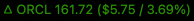

# SwiftBar Stock Price Plugin (Twelve Data)

This SwiftBar plugin displays the stock price, change, and percent change for any symbol using the [Twelve Data API](https://twelvedata.com/).

This version uses the Twelve Data API as the primary source because Nasdaq’s public API is meant for manual/browser access and may block frequent automated curl requests. On any Twelve Data failure (HTTP error, JSON error, or rate-limit) it falls back to Nasdaq’s quote API. It also caches the last close and previous close values to display $change/percent when the market is closed.

**The symbol is determined by the script filename:**
For example, `aapl.sh` will show Apple (AAPL), `orcl.sh` will show Oracle (ORCL), etc.



## Requirements

- [SwiftBar](https://swiftbar.app/)
  Install via Homebrew:
  ```bash
  brew install --cask swiftbar
  ```
- [`jq`](https://stedolan.github.io/jq/) (for JSON parsing)
  Install via Homebrew:
  ```bash
  brew install jq
  ```
- **Bash 5.0 or newer** (the script uses `readarray` and other features not available in Apple’s Bash 3.2). Install via Homebrew:
  ```bash
  brew install bash
  ```
- **A free [Twelve Data API key](https://twelvedata.com/)**
  Sign up at [twelvedata.com](https://twelvedata.com/) to get your API key.

---

**Proxy Note:**
If your environment requires a proxy to access the internet, you will need to configure `curl` accordingly.
You can do this by updating your `~/.curlrc` file. For example, add the following lines to `~/.curlrc`:

```
proxy = "http://your-proxy-host:port"
proxy-user = "username:password"
```

Adjust these settings as needed for your proxy configuration.

---

## Usage

1. **Copy and Rename the Script**

   Copy the script to your SwiftBar plugins folder and rename it to match the symbol you want (lowercase or uppercase, `.sh` extension required):

   ```bash
   cp orcl.sh aapl.sh   # For Apple
   cp orcl.sh msft.sh   # For Microsoft
   ```

2. **Set Up Your Twelve Data API Key**

   Store your Twelve Data API key securely in your macOS Keychain:

   ```bash
   security add-generic-password -a "$USER" -s "twelvedata_api_key" -w "<YOUR_API_KEY>"
   ```

   Replace `<YOUR_API_KEY>` with your actual Twelve Data API key.

   - To update the key, run the same command with the new key.
   - To delete the key:

     ```bash
     security delete-generic-password -a "$USER" -s "twelvedata_api_key"
     ```

3. **Reload SwiftBar**

   SwiftBar will automatically pick up the new script and display the price for the symbol in the filename.

4. **Ensure Caching Works**

   The plugin will create cache files under `~/Library/Caches/` named `<SYMBOL>_cache.txt`. You don’t need to manage these manually; they’re used automatically after market hours.

5. **Fallback & Caching**

   - The plugin will first try to fetch live data from the Twelve Data API.
   - If Twelve Data is down, returns an error, or hits a rate limit, it will fetch from Nasdaq’s quote API as a fallback.
   - After a successful fetch (from either source), the last close and previous close are cached to `~/Library/Caches/<SYMBOL>_cache.txt`.
   - When the market is closed, the plugin reads from this cache to compute and display price change and percentage.

---

**Nasdaq Fallback:** If the Twelve Data API call fails (e.g. HTTP ≥500, 401/429, or JSON‐level error), the plugin uses Nasdaq’s public API (`https://api.nasdaq.com/api/quote/<SYMBOL>/info?assetclass=stocks`) to retrieve the last sale price and previous close.

---

# SSH Dropdown Menu for iTerm (ssh.sh)

This SwiftBar plugin creates a dropdown menu of all your SSH hosts (from `~/.ssh/config`).
Clicking a host opens a new iTerm tab (or window) and connects via SSH.

## Usage

1. **Copy the Script**

   Place `ssh.sh` in your SwiftBar plugins directory.

2. **Configure Your SSH Hosts**

   Make sure your SSH hosts are defined in `~/.ssh/config`, for example:

   ```
   Host myserver
     HostName myserver.example.com
     User alice

   Host devbox
     HostName 192.168.1.100
     User bob
   ```

   The plugin will list all hosts except wildcards (`Host *`).

3. **Requirements**

   - [iTerm2](https://iterm2.com/) must be installed.
   - Your SSH config file should be at `~/.ssh/config`.
   - The script uses `osascript` (AppleScript) to control iTerm.

4. **How it Works**

   - The menu bar will show "SSH".
   - Clicking a host in the dropdown opens a new iTerm tab (or window if iTerm is not running) and runs `ssh <host>`.

---

**Tip:**
If iTerm is minimized or hidden, the script will bring it to the foreground before opening the new tab or window.